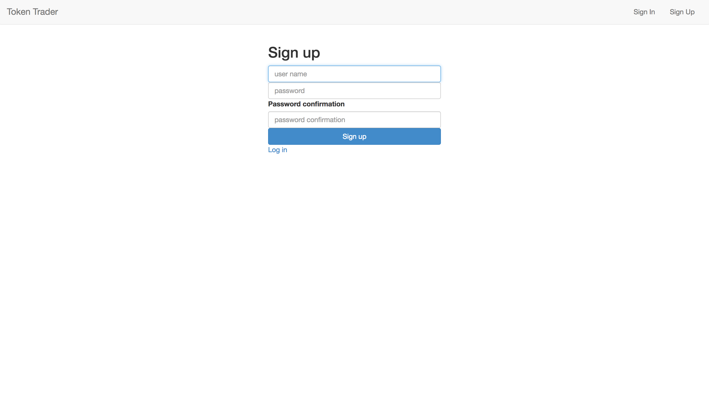
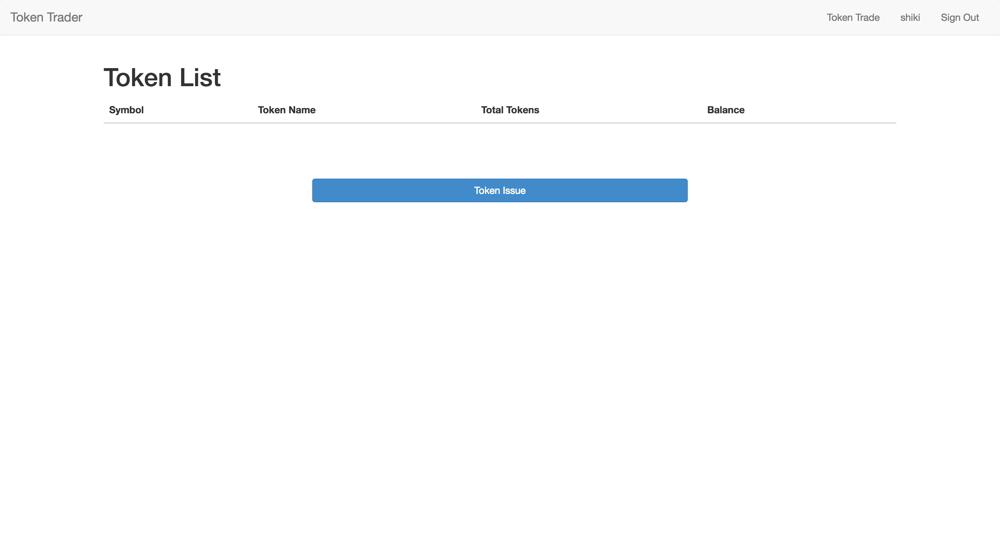
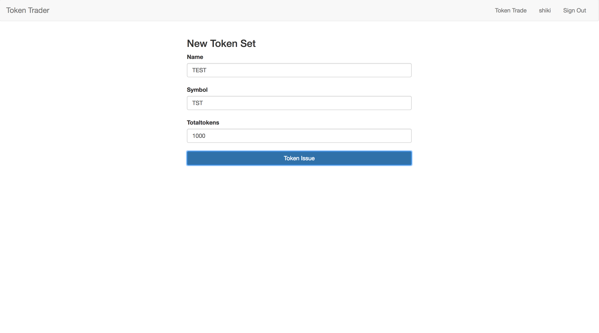
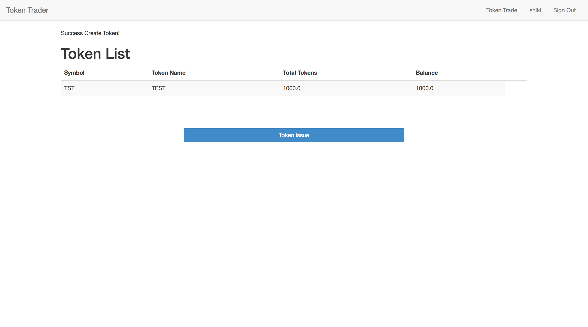
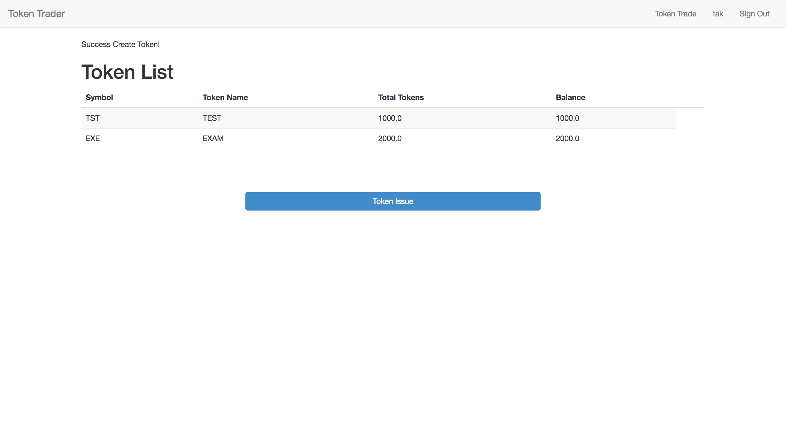
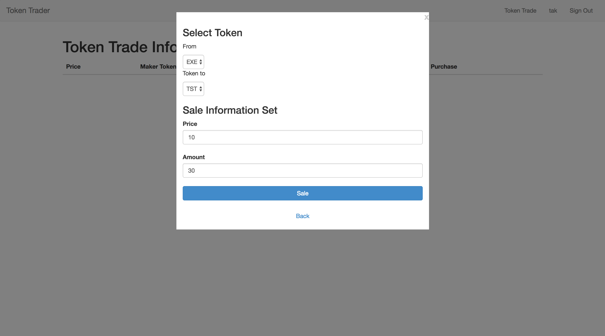
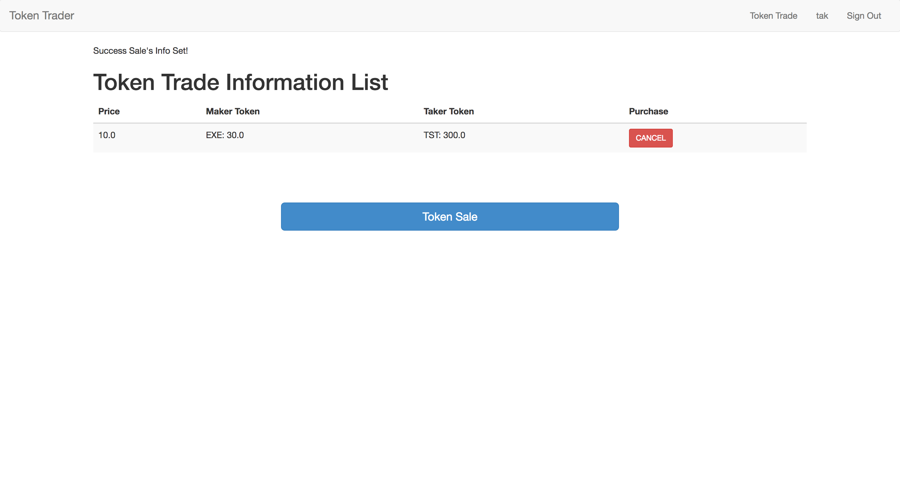
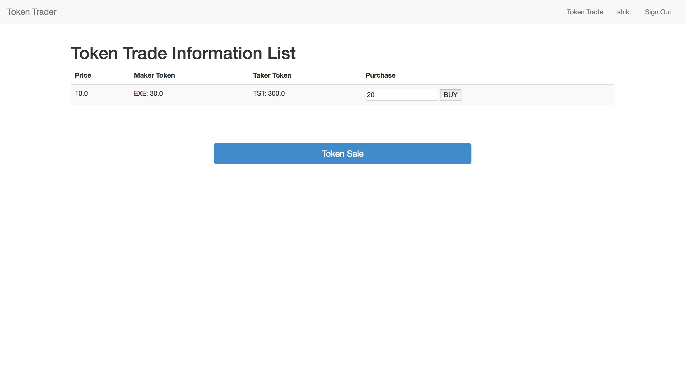
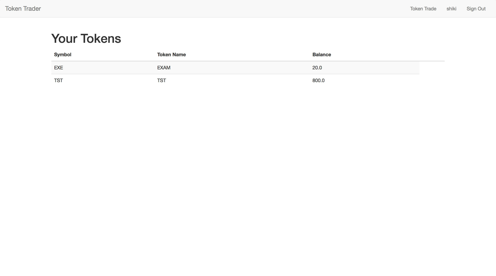
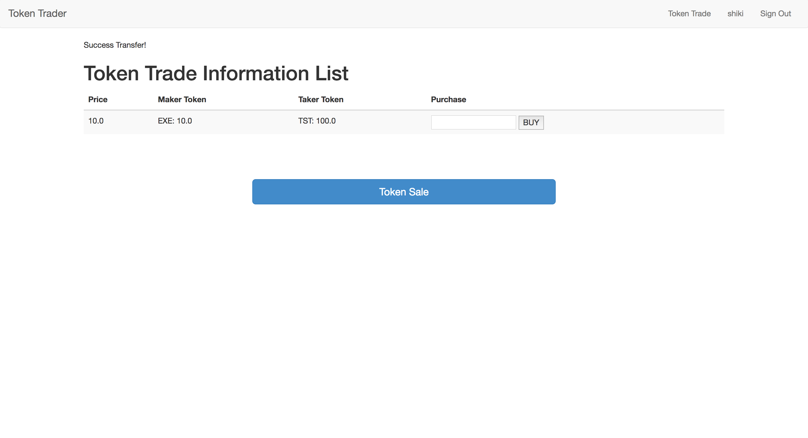

## Application Procedure
### Term
- Token: ユーザーが発行するToken
- Maker: Trade情報を作成する人
- Taker: Trade情報を元にTokenを購入するユーザー
- Indexer: Trade情報を掲載しているDB

### App flow

#### Sing up
- usernameとpasswordを入力してsing upを行う。

  

#### Issue token
- 「Token Issue」ボタンをクリックする。

  

#### Input token information
- symbol、name、発行量の情報を入力してTokenを発行する。  
  （name: TEST, symbol: TST, Totaltokens: 1000 ）

  

    
  

#### Create result
- Tokenが発行される。

  

#### Create other token
- 別のユーザーでログインしてもう一つTokenを発行する。  
  （name: EXAM, symbol: EXE, Totaltokens: 2000 ）

  

#### Input trade information
- makerはTrade情報を入力する。
  - from, to: どのTokenをトレードしたいか
  - Price: トレードに出す自分のToken（maker_token）の値段を入力
  - Amount: トレードに出す自分のTokenの総量を入力  
    ※ MakerはPrice×AmountのToken（taker_token）を購入することができる

  

#### Create result
- Trade情報が反映される。

  

#### Buy token
- TakerはTrade情報から購入するTokenを選び、購入するTokenの量を入力する。

  

#### Trade result
- Tradeが成功すると、ユーザーの所有しているToken情報が更新される。

  

- Trade情報も同様に更新される。

  

