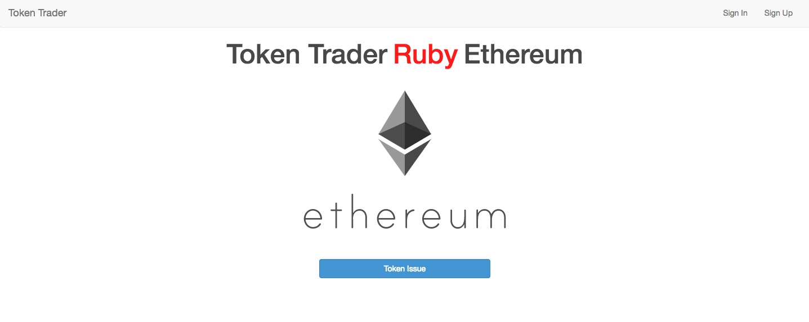
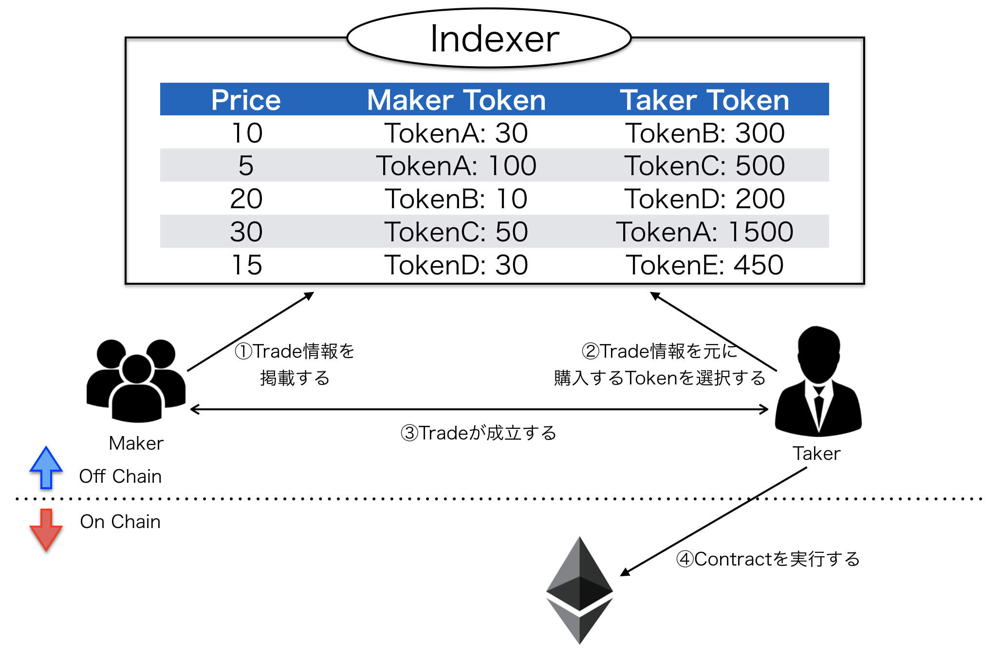

# Token Trader App
このアプリケーションはEthereumを使ったアプリ開発の流れを習得するために開発したTokenをトレードするデモアプリです。  



トークンはEthereumが提唱しているトークンの標準仕様「ERC20」に準拠しています。  
トレードは[SwapのWhitepaper](https://swap.tech/whitepaper "whitepaper")を参考に実装しました。  トレードの流れは以下の通りです。  



【目標】
- EthereumのAPIを使い、WebブラウザからSmart Contractを実行する方法を理解する。
- Rubyで書かれたEthereumのライブラリが使えるようになる。  


実装は最低限のものだけを行なっており、allowanceなど使っていない関数もあります。（2017/10/21現在）
Ethereumを使ったアプリ開発の技術習得を目標としているので、  
「これはERC20に準拠してない！」「これは〜だからSwapではない！」「オフチェーンとオンチェーンの住み分けができてない！」などなど、ご指摘を絶賛募集中です。  
よろしくお願いいたします。


## Requirements
- Ruby 2.3.0
- Rails 5.0.6
- postgresql
- go-ethereum 1.5.5
- ethereum.rb 0.5.2  
 (https://github.com/EthWorks/ethereum.rb.git)

## Set up
※ リポジトリのPATHは各自の環境に合わせてください※
### 1. Gethのインストール    
  1. go-ethereumをgitリポジトリからクローンする  
  ```
  $ git clone https://github.com/ethereum/go-ethereum.git
  $ cd go-ethereum
  $ git checkout refs/tags/v1.5.5
  ```
  2. make gethでビルドする
  ```
  $ make geth
  ```
  3. Gethのバージョン確認
  ```
  $ ./build/bin/geth version
  Geth
  Version: 1.5.5-stable
  Git Commit: ff07d54843ea7ed9997c420d216b4c007f9c80c3
  Protocol Versions: [63 62]
  Network Id: 1
  Go Version: go1.8.3
  OS: darwin
  GOPATH=/Users/shikitakahashi/go
  GOROOT=/usr/local/Cellar/go/1.8.3/libexec
  ```
  4. Gethを/usr/local/binにコピーする
  ```
  $ sudo cp build/bin/geth /usr/local/bin/
  ```
  5. パスが通っていることを確認する
  ```
  $ which geth
  /usr/local/bin/geth
  ```

### 2. テストネットワークでGethを起動する
  1. データディレクトリを準備する
  ```
  $ mkdir ~/data_testnet
  $ cd data_testnet/
  $ pwd
  /home/eth/data_testnet
  ```
  2. Genesisファイルを作成する
  ```
  $ vi genesis.json
  {
    "nonce": "0x0000000000000042",
    "timestamp": "0x0",
    "parentHash": "0x0000000000000000000000000000000000000000000000000000000000000000",
    "extraData": "0x0",
    "gasLimit": "0xffffffff",
    "difficulty": "0x4000",
    "mixhash": "0x0000000000000000000000000000000000000000000000000000000000000000",
    "coinbase": "0x0000000000000000000000000000000000000000",
    "alloc": {}
    }
  ```
  3. Gethを初期化する
  ```
  $ geth --datadir /home/eth/data_testnet init /home/eth/data_testnet/genesis.json
  ```
  4. Gethを起動する  
  今回はHTTP-RPCサーバーを有効にして起動する
  ```
  geth --networkid 4649 --nodiscover --maxpeers 0 --datadir /home/eth/data_testnet
   --mine --minerthreads 1 --rpc --rpcaddr "0.0.0.0" --rport 8545 --rpccorsdomain "*" --rpcapi "admin, db, eth,
   debug, miner, net, shh, txpool, personal, web3" 2>> /home/eth/data_testnet/geth.log
  ```
  5. 以下のコマンドでGethのコンソールに接続して正常に起動しているか確認する
  ```
  $ geth attach rpc:http://localhost:8545
  Welcome to the Geth JavaScript console!
  instance: Geth/v1.5.5-stable-ff07d548/darwin/go1.8.3
  coinbase: 0xd34da9604e5e9c2a9cc0aa481b6b24a72af3253b
  at block: 50837 (Sat, 21 Oct 2017 18:09:00 JST)
  datadir: /home/eth/data_testnet
  modules: admin:1.0 debug:1.0 eth:1.0 miner:1.0 net:1.0 personal:1.0 rpc:1.0 txpool:1.0 web3:1.0
  >
  ```
  6. EOAを作成し、マイニングを開始する
  ```
  > personal.newAccount("pass0")
  "0xd34da9604e5e9c2a9cc0aa481b6b24a72af3253b"
  > eth.coinbase
  "0xd34da9604e5e9c2a9cc0aa481b6b24a72af3253b"
  > miner.start(1)
  true
  ```
  初回はDAG(Directed acyclic graph)の生成が行われるため、マイニングが行われるまでに若干時間がかかる。  
  マイニングが始まればハッシュレートが1以上の値となる。
  ```
  > eth.hashrate
  140956
  ```

### 3. Smart contract開発用のコンパイラをインストール
  1. 以下のコマンドを実行してSolidityのコンパイラをインストールする。
  ```
  $ brew update
  $ brew upgrade
  $ brew tap ethereum/ethereum
  $ brew install solidity
  $ brew linkapps solidity
  ```
  2. インストールされたことを確認する。
  ```
  $ solc --version
  solc, the solidity compiler commandline interface
  Version: 0.4.15+commit.8b45bddb.Darwin.appleclang
  ```
  3. solcのPATHを確認する。
  ```
  $ which solc
  /usr/local/bin/solc
  ```
  4. admin.setSolcコマンドでGethにsolcのパスをセットする。
  ```
  > admin.setSolc("/usr/bin/solc")
  ```
  正しく、セットされたことを確認する。
  ```
  > eth.getCompilers()
  ["Solidity"]
  ```

### 4. アプリケーションの設定
  以下のコマンドを実行し、アプリケーションを起動する。
  ```
  $ git clone https://github.com/shiki-tak/token-trader-app.git
  $ bundle install
  $ rake db:create
  $ rake db:migrate
  $ rails s
  ```

## Issue
1. コントラクトの実行速度が遅い  
'transact_and_wait'を使ってコントラクトを実行しているが、一つのトランザクションが完了するまで、次の処理に進まないため、Tokenの発行やトレードに時間がかかる。

2. EOAのアドレスをRDBに保存している  
誰がコントラクトを実行したのかを識別するために、deviseで作ったユーザー情報とその情報を元にハッシュ化した情報を元にEOAを管理している。（hashedusersテーブル）  
しかし、EOAの情報をRDBに保存するのは果たして正しいのか？
EOAをRDBに保存せずに、コントラクトを実行できる方法はないのか？

3. EOAが一度ロックされると解除できない  
これは、ただのバグのような気もするが、EOAを作成して、同時にアンロックするようにしてある。  
これは時間が経過するとロックされるのでコントラクト実行の直前にpersonal_unlock_accountでアカウントをアンロックするようにしているが、うまくロックが解除できない。

4. リファクタリング  
Ethereumとは直接関係ないが、ビジネスロジックをどこにどう書き、責務をどう分けるか、要検討。
